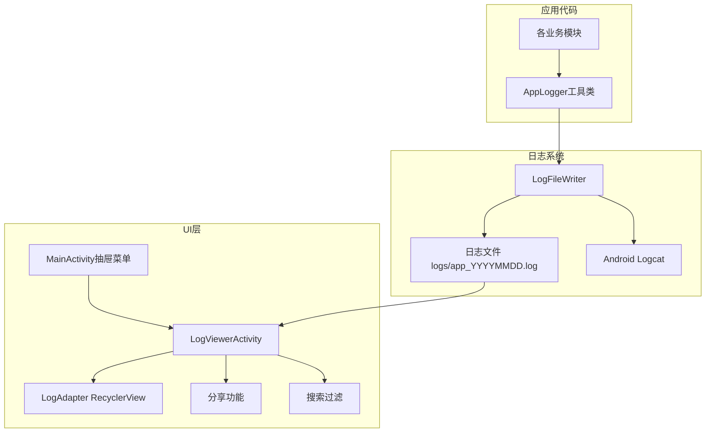

# 设计文档 - 应用日志查看与导出功能

## 概述
通过自定义日志工具类拦截所有Log输出并写入文件，新增日志查看Activity集成到抽屉菜单，支持查看、搜索、分享日志。

## 架构设计

### 系统架构图


### 技术栈
- **日志写入**：BufferedWriter + 异步线程
- **日志读取**：BufferedReader + 分页加载
- **UI组件**：RecyclerView + SearchView
- **文件分享**：FileProvider + Intent.ACTION_SEND

## 详细设计

### 文件结构
```
app/src/main/java/com/caleb/scheduledplayer/
├── util/
│   └── AppLogger.java              # 新增：日志工具类（单例）
├── presentation/ui/
│   └── log/
│       ├── LogViewerActivity.java  # 新增：日志查看界面
│       └── LogAdapter.java         # 新增：日志列表适配器

app/src/main/res/
├── layout/
│   ├── activity_log_viewer.xml     # 新增：日志界面布局
│   └── item_log.xml                # 新增：日志条目布局
├── menu/
│   └── menu_drawer.xml             # 修改：添加日志菜单项
│   └── menu_log_viewer.xml         # 新增：日志界面toolbar菜单
```

### 核心类设计

#### 1. AppLogger（日志工具类）
```java
public class AppLogger {
    private static final String LOG_DIR = "logs";
    private static final long MAX_FILE_SIZE = 500 * 1024 * 1024; // 500MB
    private static final int RETENTION_DAYS = 7;
    
    private static AppLogger instance;
    private BufferedWriter writer;
    private ExecutorService executor;
    private File currentLogFile;
    private SimpleDateFormat dateFormat;
    
    // 单例获取
    public static synchronized AppLogger getInstance();
    
    // 初始化（Application.onCreate调用）
    public void init(Context context);
    
    // 日志方法（替代Log.d/i/w/e）
    public void d(String tag, String msg);
    public void i(String tag, String msg);
    public void w(String tag, String msg);
    public void e(String tag, String msg);
    public void e(String tag, String msg, Throwable tr);
    
    // 内部方法
    private void writeToFile(String level, String tag, String msg);
    private void checkRotation();      // 检查文件大小，需要时轮转
    private void cleanOldFiles();      // 清理过期文件
    
    // 供LogViewerActivity调用
    public File getLogDir();
    public List<File> getLogFiles();   // 按日期倒序
    public void clearAllLogs();
    public long getTotalLogSize();
}
```

#### 2. LogViewerActivity（日志查看界面）
```java
public class LogViewerActivity extends AppCompatActivity {
    private RecyclerView recyclerView;
    private LogAdapter adapter;
    private SearchView searchView;
    private List<LogEntry> allLogs;
    private List<LogEntry> filteredLogs;
    
    // 生命周期
    @Override onCreate();
    @Override onCreateOptionsMenu();  // 搜索、分享、清空菜单
    
    // 核心方法
    private void loadLogs();           // 异步加载日志
    private void filterLogs(String query);
    private void shareLogs();          // 分享日志文件
    private void clearLogs();          // 清空日志（带确认）
    private void updateStorageInfo();  // 更新存储占用显示
}
```

#### 3. LogEntry（日志条目模型）
```java
public class LogEntry {
    String timestamp;   // 时间戳
    String level;       // D/I/W/E
    String tag;         // 标签
    String message;     // 内容
    
    // 从日志行解析
    public static LogEntry parse(String line);
}
```

#### 4. LogAdapter（列表适配器）
```java
public class LogAdapter extends RecyclerView.Adapter<LogAdapter.ViewHolder> {
    private List<LogEntry> logs;
    
    @Override onBindViewHolder() {
        // 根据level设置颜色：ERROR红色，WARN橙色，其他默认
    }
}
```

### 日志文件格式
```
2026-01-18 10:30:45.123 D/AudioPlaybackService: startTaskPlayback called for task 1
2026-01-18 10:30:45.456 I/TaskSchedulerService: Task scheduled successfully
2026-01-18 10:30:46.789 E/AudioPlayer: Failed to play audio: FileNotFoundException
```

**格式说明**：`时间戳 级别/标签: 消息内容`

### 文件命名规则
- 文件名：`app_20260118.log`（按日期）
- 存储路径：`/data/data/com.caleb.scheduledplayer/files/logs/`

### UI设计

#### 日志查看界面布局
```
┌─────────────────────────────────┐
│ ← 日志查看        🔍  📤  🗑️   │  Toolbar（返回、搜索、分享、清空）
├─────────────────────────────────┤
│ 存储占用: 12.5 MB               │  存储信息栏
├─────────────────────────────────┤
│ 10:30:45 D/AudioService         │
│ startTaskPlayback called...     │
├─────────────────────────────────┤
│ 10:30:46 E/AudioPlayer          │  ← ERROR红色高亮
│ Failed to play audio...         │
├─────────────────────────────────┤
│ ...                             │
└─────────────────────────────────┘
```

### 关键流程

#### 日志写入流程
1. 业务代码调用 `AppLogger.d(TAG, msg)`
2. AppLogger 同时调用 `Log.d()` 输出到Logcat
3. 异步线程将日志写入当前日志文件
4. 写入前检查文件大小，超过500MB则创建新文件
5. 应用启动时清理7天前的旧文件

#### 日志查看流程
1. 用户点击抽屉菜单"日志"
2. 启动LogViewerActivity
3. 异步读取最近日志文件（最新500条）
4. 解析为LogEntry列表并显示
5. 用户可搜索、滚动加载更多

#### 日志分享流程
1. 用户点击分享按钮
2. 将最近日志文件复制到cache目录
3. 通过FileProvider生成content://URI
4. 调用Intent.ACTION_SEND分享

### 菜单修改

#### menu_drawer.xml 新增项
```xml
<item
    android:id="@+id/nav_logs"
    android:icon="@drawable/ic_log"
    android:title="日志" />
```

### FileProvider配置

#### AndroidManifest.xml
```xml
<provider
    android:name="androidx.core.content.FileProvider"
    android:authorities="${applicationId}.fileprovider"
    android:exported="false"
    android:grantUriPermissions="true">
    <meta-data
        android:name="android.support.FILE_PROVIDER_PATHS"
        android:resource="@xml/file_paths" />
</provider>
```

#### res/xml/file_paths.xml
```xml
<?xml version="1.0" encoding="utf-8"?>
<paths>
    <files-path name="logs" path="logs/" />
    <cache-path name="cache" path="/" />
</paths>
```

## 安全考虑
- 日志存储在应用私有目录，其他应用无法访问
- 分享时通过FileProvider授权临时访问
- 日志中避免记录敏感信息（密码、token等）

## 测试策略
- **单元测试**：AppLogger的文件轮转、过期清理逻辑
- **集成测试**：日志写入、读取、分享完整流程
- **边界测试**：大文件处理、存储空间不足场景
