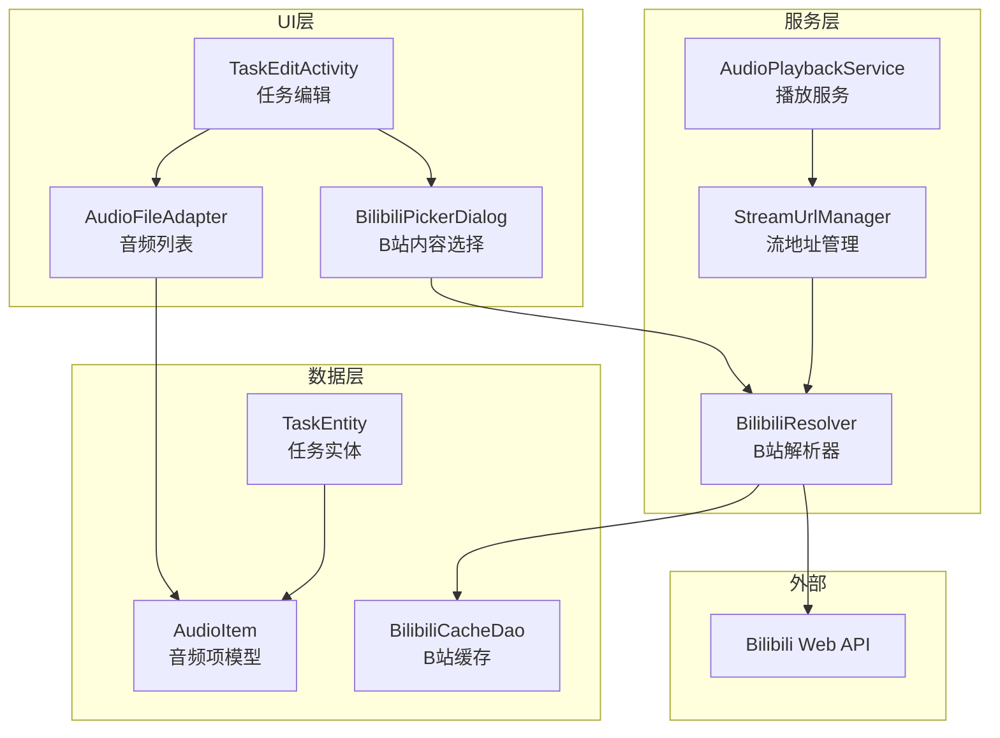

# 设计文档 - Bilibili 音频播放功能

## 概述

在现有定时播放架构基础上，扩展支持 Bilibili 视频音频流的后台播放。通过解析 Bilibili Web API 获取音频流地址，使用 ExoPlayer 播放网络音频流，与本地音频统一管理。

## 架构设计

### 系统架构图



### 技术栈

| 层级 | 技术选型 | 说明 |
|------|---------|------|
| 网络请求 | OkHttp | 请求 Bilibili API |
| JSON 解析 | org.json (已有) | 解析 API 响应 |
| 音频播放 | ExoPlayer | 播放网络音频流（DASH格式） |
| 数据存储 | Room (已有) | 缓存视频元数据 |
| 图片加载 | Glide | 加载视频封面 |

## 详细设计

### 1. 数据模型设计

#### 1.1 AudioItem - 统一音频项模型

```java
/**
 * 统一音频项模型
 * 支持本地文件和 Bilibili 音频
 */
public class AudioItem {
    
    public enum Type {
        LOCAL,      // 本地文件
        BILIBILI    // B站视频音频
    }
    
    private Type type;
    private String id;           // 唯一标识：本地为路径，B站为 BV号
    private String title;        // 标题
    private String coverUrl;     // 封面URL（B站）
    private long duration;       // 时长（毫秒）
    private String localPath;    // 本地文件路径（仅本地类型）
    
    // Bilibili 专用字段
    private String bvid;         // BV号
    private long aid;            // AV号
    private long cid;            // 分P的cid
    private String author;       // UP主
    private long cachedAt;       // 元数据缓存时间
    
    // JSON 序列化/反序列化方法
    public String toJson() { ... }
    public static AudioItem fromJson(String json) { ... }
    
    // 兼容旧格式：纯路径字符串视为本地文件
    public static AudioItem fromLegacyPath(String path) { ... }
}
```

#### 1.2 数据存储格式变更

**TaskEntity.audioPaths 字段格式升级：**

```json
// 旧格式（向后兼容）
["/storage/music/song1.mp3", "/storage/music/song2.mp3"]

// 新格式
[
  {"type":"LOCAL","id":"/storage/music/song1.mp3","title":"Song 1","localPath":"/storage/music/song1.mp3"},
  {"type":"BILIBILI","id":"BV1xx411c7mD","title":"视频标题","bvid":"BV1xx411c7mD","aid":12345,"cid":67890,"coverUrl":"https://...","duration":180000,"author":"UP主名"}
]
```

#### 1.3 BilibiliCacheEntity - B站缓存表

```java
@Entity(tableName = "bilibili_cache")
public class BilibiliCacheEntity {
    @PrimaryKey
    @NonNull
    private String bvid;           // BV号
    
    private long aid;              // AV号
    private long cid;              // 分P cid
    private String title;          // 标题
    private String author;         // UP主
    private String coverUrl;       // 封面
    private long duration;         // 时长（毫秒）
    private String audioUrl;       // 音频流地址（临时）
    private long audioUrlExpireAt; // 音频流过期时间
    private long createdAt;        // 首次缓存时间
    private long updatedAt;        // 更新时间
}
```

### 2. Bilibili 解析服务

#### 2.1 BilibiliResolver - 核心解析器

```java
public class BilibiliResolver {
    
    private static final String TAG = "BilibiliResolver";
    private final OkHttpClient client;
    private final BilibiliCacheDao cacheDao;
    
    // API 端点
    private static final String API_VIDEO_INFO = "https://api.bilibili.com/x/web-interface/view";
    private static final String API_PLAY_URL = "https://api.bilibili.com/x/player/playurl";
    
    /**
     * 解析视频链接或BV号
     * @param input 支持格式：
     *   - BV号: BV1xx411c7mD
     *   - 完整链接: https://www.bilibili.com/video/BV1xx411c7mD
     *   - 短链接: https://b23.tv/xxxxx
     * @return 视频信息
     */
    public Single<BilibiliVideoInfo> resolveVideo(String input) {
        return Single.create(emitter -> {
            String bvid = extractBvid(input);
            if (bvid == null) {
                emitter.onError(new IllegalArgumentException("无效的B站链接"));
                return;
            }
            
            // 1. 检查缓存
            BilibiliCacheEntity cached = cacheDao.getByBvid(bvid);
            if (cached != null && !isMetadataExpired(cached)) {
                emitter.onSuccess(BilibiliVideoInfo.fromCache(cached));
                return;
            }
            
            // 2. 请求视频信息 API
            Request request = new Request.Builder()
                .url(API_VIDEO_INFO + "?bvid=" + bvid)
                .header("User-Agent", USER_AGENT)
                .header("Referer", "https://www.bilibili.com")
                .build();
            
            try (Response response = client.newCall(request).execute()) {
                JSONObject json = new JSONObject(response.body().string());
                if (json.getInt("code") != 0) {
                    emitter.onError(new Exception(json.getString("message")));
                    return;
                }
                
                JSONObject data = json.getJSONObject("data");
                BilibiliVideoInfo info = parseVideoInfo(data);
                
                // 3. 更新缓存
                cacheDao.insertOrUpdate(info.toCache());
                
                emitter.onSuccess(info);
            } catch (Exception e) {
                emitter.onError(e);
            }
        }).subscribeOn(Schedulers.io());
    }
    
    /**
     * 获取音频流地址
     * 地址有时效性，约2小时过期
     */
    public Single<String> getAudioStreamUrl(String bvid, long cid) {
        return Single.create(emitter -> {
            // 1. 检查缓存的流地址是否有效
            BilibiliCacheEntity cached = cacheDao.getByBvid(bvid);
            if (cached != null && cached.getAudioUrl() != null 
                && System.currentTimeMillis() < cached.getAudioUrlExpireAt()) {
                emitter.onSuccess(cached.getAudioUrl());
                return;
            }
            
            // 2. 请求播放地址 API
            String url = API_PLAY_URL + "?bvid=" + bvid + "&cid=" + cid 
                + "&fnval=16";  // fnval=16 请求 DASH 格式
            
            Request request = new Request.Builder()
                .url(url)
                .header("User-Agent", USER_AGENT)
                .header("Referer", "https://www.bilibili.com/video/" + bvid)
                .build();
            
            try (Response response = client.newCall(request).execute()) {
                JSONObject json = new JSONObject(response.body().string());
                if (json.getInt("code") != 0) {
                    emitter.onError(new Exception(json.getString("message")));
                    return;
                }
                
                // 解析 DASH 音频流
                JSONObject dash = json.getJSONObject("data").getJSONObject("dash");
                JSONArray audios = dash.getJSONArray("audio");
                
                // 选择最高质量的音频流
                String audioUrl = selectBestAudio(audios);
                
                // 3. 缓存流地址（设置1.5小时过期，留出余量）
                long expireAt = System.currentTimeMillis() + 90 * 60 * 1000;
                cacheDao.updateAudioUrl(bvid, audioUrl, expireAt);
                
                emitter.onSuccess(audioUrl);
            } catch (Exception e) {
                emitter.onError(e);
            }
        }).subscribeOn(Schedulers.io());
    }
    
    /**
     * 从输入中提取 BV 号
     */
    private String extractBvid(String input) {
        // BV号格式: BV + 10位字符
        Pattern bvPattern = Pattern.compile("BV[a-zA-Z0-9]{10}");
        Matcher matcher = bvPattern.matcher(input);
        if (matcher.find()) {
            return matcher.group();
        }
        return null;
    }
    
    /**
     * 选择最佳音频流
     */
    private String selectBestAudio(JSONArray audios) throws JSONException {
        String bestUrl = null;
        int bestBandwidth = 0;
        
        for (int i = 0; i < audios.length(); i++) {
            JSONObject audio = audios.getJSONObject(i);
            int bandwidth = audio.getInt("bandwidth");
            if (bandwidth > bestBandwidth) {
                bestBandwidth = bandwidth;
                bestUrl = audio.getString("baseUrl");
            }
        }
        return bestUrl;
    }
}
```

#### 2.2 StreamUrlManager - 流地址管理器

```java
/**
 * 管理音频流地址的刷新和缓存
 * 在播放服务中使用，确保播放时地址有效
 */
public class StreamUrlManager {
    
    private final BilibiliResolver resolver;
    private final Map<String, StreamInfo> activeStreams = new ConcurrentHashMap<>();
    private final Handler refreshHandler = new Handler(Looper.getMainLooper());
    
    /**
     * 获取有效的音频流地址
     * 如果地址即将过期，会自动刷新
     */
    public Single<String> getValidStreamUrl(AudioItem item) {
        if (item.getType() != AudioItem.Type.BILIBILI) {
            return Single.just(item.getLocalPath());
        }
        
        StreamInfo info = activeStreams.get(item.getBvid());
        if (info != null && !info.isExpiringSoon()) {
            return Single.just(info.url);
        }
        
        // 需要刷新
        return resolver.getAudioStreamUrl(item.getBvid(), item.getCid())
            .doOnSuccess(url -> {
                activeStreams.put(item.getBvid(), new StreamInfo(url));
                scheduleRefresh(item);
            });
    }
    
    /**
     * 预刷新即将过期的地址
     */
    private void scheduleRefresh(AudioItem item) {
        // 在过期前10分钟刷新
        long refreshDelay = 80 * 60 * 1000; // 80分钟后刷新
        refreshHandler.postDelayed(() -> {
            if (activeStreams.containsKey(item.getBvid())) {
                getValidStreamUrl(item).subscribe();
            }
        }, refreshDelay);
    }
}
```

### 3. 播放服务改造

#### 3.1 ExoPlayer 集成

```java
// AudioPlaybackService.java 中的改造

public class AudioPlaybackService extends Service {
    
    // 新增 ExoPlayer 相关
    private ExoPlayer exoPlayer;
    private StreamUrlManager streamUrlManager;
    
    @Override
    public void onCreate() {
        super.onCreate();
        // ... 现有初始化代码 ...
        
        // 初始化 ExoPlayer（用于网络音频）
        exoPlayer = new ExoPlayer.Builder(this).build();
        streamUrlManager = new StreamUrlManager(new BilibiliResolver(this));
    }
    
    /**
     * 改造后的 TaskPlayer 内部类
     * 支持本地文件（MediaPlayer）和网络流（ExoPlayer）
     */
    private class TaskPlayer {
        private MediaPlayer mediaPlayer;      // 本地文件播放
        private ExoPlayer networkPlayer;      // 网络流播放
        private List<AudioItem> playlist;     // 统一使用 AudioItem
        private int currentIndex;
        private boolean isPlaying;
        
        void playItem(AudioItem item) {
            if (item.getType() == AudioItem.Type.LOCAL) {
                playLocalFile(item.getLocalPath());
            } else {
                playBilibiliAudio(item);
            }
        }
        
        private void playBilibiliAudio(AudioItem item) {
            streamUrlManager.getValidStreamUrl(item)
                .observeOn(AndroidSchedulers.mainThread())
                .subscribe(
                    url -> {
                        // 使用 ExoPlayer 播放
                        MediaItem mediaItem = MediaItem.fromUri(url);
                        networkPlayer.setMediaItem(mediaItem);
                        networkPlayer.prepare();
                        networkPlayer.play();
                    },
                    error -> {
                        AppLogger.e(TAG, "Failed to get stream URL: " + error.getMessage());
                        playNext(); // 跳到下一首
                    }
                );
        }
    }
}
```

### 4. UI 设计

#### 4.1 BilibiliPickerDialog - B站内容选择对话框

```java
/**
 * B站视频选择对话框
 * 支持：输入链接/BV号、显示预览、批量添加
 */
public class BilibiliPickerDialog extends DialogFragment {
    
    public interface OnVideoSelectedListener {
        void onVideoSelected(List<AudioItem> items);
    }
    
    private DialogBilibiliPickerBinding binding;
    private BilibiliResolver resolver;
    private List<BilibiliVideoInfo> selectedVideos = new ArrayList<>();
    
    @Override
    public View onCreateView(...) {
        binding = DialogBilibiliPickerBinding.inflate(inflater);
        
        // 输入框 + 添加按钮
        binding.btnAdd.setOnClickListener(v -> {
            String input = binding.etInput.getText().toString().trim();
            if (!input.isEmpty()) {
                resolveAndAdd(input);
            }
        });
        
        // 已选列表
        binding.recyclerSelected.setAdapter(selectedAdapter);
        
        // 确认按钮
        binding.btnConfirm.setOnClickListener(v -> {
            List<AudioItem> items = selectedVideos.stream()
                .map(BilibiliVideoInfo::toAudioItem)
                .collect(Collectors.toList());
            listener.onVideoSelected(items);
            dismiss();
        });
        
        return binding.getRoot();
    }
    
    private void resolveAndAdd(String input) {
        binding.progressBar.setVisibility(View.VISIBLE);
        resolver.resolveVideo(input)
            .observeOn(AndroidSchedulers.mainThread())
            .subscribe(
                info -> {
                    binding.progressBar.setVisibility(View.GONE);
                    if (!isDuplicate(info)) {
                        selectedVideos.add(info);
                        selectedAdapter.notifyItemInserted(selectedVideos.size() - 1);
                        binding.etInput.setText("");
                    } else {
                        Toast.makeText(getContext(), "视频已添加", Toast.LENGTH_SHORT).show();
                    }
                },
                error -> {
                    binding.progressBar.setVisibility(View.GONE);
                    Toast.makeText(getContext(), "解析失败: " + error.getMessage(), 
                        Toast.LENGTH_SHORT).show();
                }
            );
    }
}
```

#### 4.2 AudioFileAdapter 改造

```java
/**
 * 统一音频列表适配器
 * 支持显示本地文件和B站视频
 */
public class AudioFileAdapter extends RecyclerView.Adapter<AudioFileAdapter.ViewHolder> {
    
    private List<AudioItem> items = new ArrayList<>();
    
    @Override
    public void onBindViewHolder(ViewHolder holder, int position) {
        AudioItem item = items.get(position);
        
        holder.tvTitle.setText(item.getTitle());
        
        if (item.getType() == AudioItem.Type.BILIBILI) {
            // B站视频：显示封面、UP主、时长
            holder.ivCover.setVisibility(View.VISIBLE);
            Glide.with(holder.itemView)
                .load(item.getCoverUrl())
                .into(holder.ivCover);
            holder.tvSubtitle.setText(item.getAuthor() + " · " + formatDuration(item.getDuration()));
            holder.ivType.setImageResource(R.drawable.ic_bilibili);
        } else {
            // 本地文件：显示文件图标
            holder.ivCover.setVisibility(View.GONE);
            holder.tvSubtitle.setText(getFileName(item.getLocalPath()));
            holder.ivType.setImageResource(R.drawable.ic_music_note);
        }
    }
}
```

### 5. 依赖配置

```gradle
// app/build.gradle 新增依赖

dependencies {
    // ... 现有依赖 ...
    
    // OkHttp - 网络请求
    implementation 'com.squareup.okhttp3:okhttp:4.12.0'
    
    // ExoPlayer - 网络音频播放
    implementation 'androidx.media3:media3-exoplayer:1.2.1'
    implementation 'androidx.media3:media3-exoplayer-dash:1.2.1'
    
    // Glide - 图片加载
    implementation 'com.github.bumptech.glide:glide:4.16.0'
    annotationProcessor 'com.github.bumptech.glide:compiler:4.16.0'
    
    // RxJava - 异步处理（可选，也可用 Kotlin 协程）
    implementation 'io.reactivex.rxjava3:rxjava:3.1.8'
    implementation 'io.reactivex.rxjava3:rxandroid:3.0.2'
}
```

## 安全考虑

| 风险 | 措施 |
|------|------|
| API 请求频率限制 | 实现本地缓存，减少重复请求 |
| 音频流地址泄露 | 地址仅在内存中，不持久化 |
| 网络请求失败 | 实现重试机制，优雅降级 |
| 内存泄漏 | ExoPlayer 生命周期管理 |

## 兼容性处理

### 数据迁移

```java
// AppDatabase.java 数据库迁移

static final Migration MIGRATION_X_Y = new Migration(X, Y) {
    @Override
    public void migrate(SupportSQLiteDatabase database) {
        // 1. 创建 B站缓存表
        database.execSQL(
            "CREATE TABLE IF NOT EXISTS bilibili_cache (" +
            "bvid TEXT PRIMARY KEY NOT NULL, " +
            "aid INTEGER, cid INTEGER, " +
            "title TEXT, author TEXT, coverUrl TEXT, " +
            "duration INTEGER, audioUrl TEXT, audioUrlExpireAt INTEGER, " +
            "createdAt INTEGER, updatedAt INTEGER)"
        );
        
        // 2. audioPaths 字段格式保持 JSON 字符串，无需迁移
        // 旧格式在读取时自动兼容转换
    }
};
```

### 旧数据兼容

```java
// Converters.java 中添加兼容解析

public static List<AudioItem> parseAudioItems(String json) {
    if (json == null || json.isEmpty()) {
        return new ArrayList<>();
    }
    
    try {
        JSONArray array = new JSONArray(json);
        List<AudioItem> items = new ArrayList<>();
        
        for (int i = 0; i < array.length(); i++) {
            Object element = array.get(i);
            if (element instanceof String) {
                // 旧格式：纯路径字符串
                items.add(AudioItem.fromLegacyPath((String) element));
            } else if (element instanceof JSONObject) {
                // 新格式：AudioItem JSON
                items.add(AudioItem.fromJson(element.toString()));
            }
        }
        return items;
    } catch (JSONException e) {
        return new ArrayList<>();
    }
}
```

## 测试策略

| 测试类型 | 覆盖范围 |
|---------|---------|
| 单元测试 | BilibiliResolver 解析逻辑、AudioItem 序列化 |
| 集成测试 | API 请求、数据库缓存 |
| UI 测试 | 添加/删除 B站视频、播放列表显示 |
| 手动测试 | 实际播放、跨天任务、网络中断恢复 |

## 关键流程

### 添加 B 站视频流程

```
1. 用户点击"添加B站视频"按钮
2. 弹出 BilibiliPickerDialog
3. 用户输入链接/BV号
4. BilibiliResolver 解析获取视频信息
5. 显示视频预览（封面、标题、UP主、时长）
6. 用户确认添加
7. AudioItem 添加到任务的音频列表
8. 保存任务
```

### 播放 B 站音频流程

```
1. TaskScheduleManager 触发任务开始
2. AudioPlaybackService 加载任务
3. 解析 audioPaths 获取 AudioItem 列表
4. 对于 BILIBILI 类型：
   a. StreamUrlManager 获取/刷新音频流地址
   b. ExoPlayer 播放网络流
5. 对于 LOCAL 类型：
   a. MediaPlayer 播放本地文件
6. 播放完成后，根据播放模式切换下一首
```

---

我已经完成了技术设计文档，包括：
- 系统架构设计
- 数据模型定义（AudioItem、BilibiliCacheEntity）
- API 接口设计（BilibiliResolver、StreamUrlManager）
- 播放服务改造方案
- UI 组件设计
- 安全和兼容性策略

**设计看起来可以吗？如果可以，我们就可以进入实施计划阶段。**
