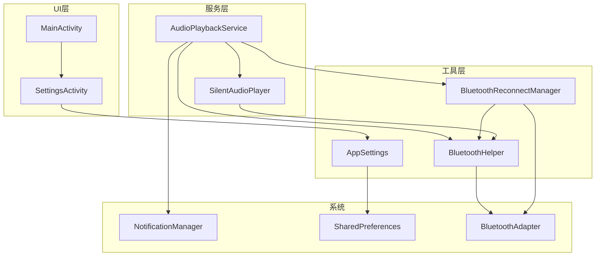

# 设计文档 - 蓝牙连接保持功能

## 概述
在现有 `AudioPlaybackService` 和 `BluetoothHelper` 基础上，扩展蓝牙连接保持、自动重连和用户通知功能，并在侧边栏菜单中新增设置页面供用户配置。

## 架构设计

### 系统架构图


### 技术栈
- **存储**：SharedPreferences（设置项持久化）
- **服务**：前台服务 AudioPlaybackService（已有）
- **通知**：NotificationCompat
- **蓝牙**：BluetoothAdapter, BluetoothA2dp, BluetoothProfile

## 详细设计

### 1. 数据模型

#### AppSettings - 全局设置管理类
```java
public class AppSettings {
    private static final String PREF_NAME = "app_settings";
    private static final String KEY_KEEP_BLUETOOTH_ALIVE = "keep_bluetooth_alive";
    private static final String KEY_BLUETOOTH_AUTO_RECONNECT = "bluetooth_auto_reconnect";
    
    private final SharedPreferences prefs;
    
    // 保持蓝牙活跃（默认 true）
    public boolean isKeepBluetoothAlive();
    public void setKeepBluetoothAlive(boolean enabled);
    
    // 蓝牙自动重连（默认 true）
    public boolean isBluetoothAutoReconnect();
    public void setBluetoothAutoReconnect(boolean enabled);
}
```

### 2. 核心组件设计

#### 2.1 SilentAudioPlayer - 静音音频播放器
```java
/**
 * 静音音频播放器
 * 用于保持蓝牙音频通道活跃
 */
public class SilentAudioPlayer {
    private MediaPlayer mediaPlayer;
    private boolean isPlaying = false;
    
    // 开始播放静音音频（循环）
    public void start();
    
    // 停止播放
    public void stop();
    
    // 暂停（有任务播放时调用）
    public void pause();
    
    // 恢复（任务播放结束后调用）
    public void resume();
    
    public boolean isPlaying();
}
```

**实现要点**：
- 使用极低码率的静音音频文件（约 1KB）
- 设置 `setVolume(0f, 0f)` 确保无声
- 循环播放 `setLooping(true)`

#### 2.2 BluetoothReconnectManager - 蓝牙重连管理器
```java
/**
 * 蓝牙自动重连管理器
 */
public class BluetoothReconnectManager {
    private BluetoothDevice lastConnectedDevice;
    private BluetoothA2dp bluetoothA2dp;
    private boolean isReconnecting = false;
    
    // 记录当前连接的设备
    public void saveConnectedDevice(BluetoothDevice device);
    
    // 获取上次连接的设备
    public BluetoothDevice getLastConnectedDevice();
    
    // 尝试重连（尽力而为）
    public void tryReconnect(ReconnectCallback callback);
    
    // 检查设备是否已重新连接
    public boolean isDeviceConnected(BluetoothDevice device);
    
    public interface ReconnectCallback {
        void onReconnectSuccess();
        void onReconnectFailed(String reason);
    }
}
```

**实现要点**：
- 使用 `BluetoothAdapter.getProfileProxy()` 获取 A2DP 代理
- 通过反射调用 `BluetoothA2dp.connect(device)` 尝试重连
- 设置重连超时和重试次数

#### 2.3 BluetoothHelper 扩展
```java
// 新增接口方法
public interface BluetoothConnectionListener {
    void onBluetoothAudioConnected();
    void onBluetoothAudioDisconnected();
    // 新增：获取断开的设备信息
    void onBluetoothDeviceDisconnected(BluetoothDevice device);
    // 新增：获取连接的设备信息
    void onBluetoothDeviceConnected(BluetoothDevice device);
}

// 新增方法
public BluetoothDevice getCurrentConnectedA2dpDevice();
```

### 3. 设置页面设计

#### 3.1 布局文件 activity_settings.xml
```xml
<LinearLayout>
    <androidx.appcompat.widget.Toolbar />
    
    <ScrollView>
        <LinearLayout>
            <!-- 蓝牙设置分组 -->
            <TextView android:text="蓝牙设置" />
            
            <!-- 保持蓝牙活跃 -->
            <LinearLayout>
                <LinearLayout>
                    <TextView android:text="保持蓝牙活跃" />
                    <TextView android:text="在后台播放静音音频，防止蓝牙连接断开" />
                </LinearLayout>
                <Switch android:id="@+id/switch_keep_bluetooth_alive" />
            </LinearLayout>
            
            <!-- 蓝牙自动重连 -->
            <LinearLayout>
                <LinearLayout>
                    <TextView android:text="蓝牙自动重连" />
                    <TextView android:text="蓝牙断开后自动尝试重新连接" />
                </LinearLayout>
                <Switch android:id="@+id/switch_bluetooth_auto_reconnect" />
            </LinearLayout>
        </LinearLayout>
    </ScrollView>
</LinearLayout>
```

#### 3.2 菜单更新 menu_drawer.xml
```xml
<menu>
    <group android:checkableBehavior="single">
        <item android:id="@+id/nav_tasks" android:title="任务管理" />
        <item android:id="@+id/nav_music" android:title="音乐管理" />
        <item android:id="@+id/nav_settings" android:title="设置" />
    </group>
</menu>
```

### 4. 通知设计

#### 通知渠道
- 复用现有通知渠道或创建新的 `bluetooth_status` 渠道

#### 通知内容
| 事件 | 标题 | 内容 |
|------|------|------|
| 蓝牙断开 | 蓝牙已断开 | 设备 "{设备名}" 已断开连接 |
| 蓝牙断开（播放中） | 蓝牙已断开 | 音频已切换到手机扬声器 |
| 蓝牙重连成功 | 蓝牙已连接 | 设备 "{设备名}" 已重新连接 |

### 5. AudioPlaybackService 集成

```java
public class AudioPlaybackService extends Service {
    private AppSettings appSettings;
    private SilentAudioPlayer silentAudioPlayer;
    private BluetoothReconnectManager reconnectManager;
    
    @Override
    public void onCreate() {
        // ... 现有代码 ...
        appSettings = new AppSettings(this);
        silentAudioPlayer = new SilentAudioPlayer(this);
        reconnectManager = new BluetoothReconnectManager(this);
        
        // 初始化蓝牙保持活跃
        if (appSettings.isKeepBluetoothAlive() && bluetoothHelper.isBluetoothAudioConnected()) {
            silentAudioPlayer.start();
        }
        
        // 扩展蓝牙监听
        bluetoothHelper.startListening(new BluetoothHelper.BluetoothConnectionListener() {
            @Override
            public void onBluetoothDeviceDisconnected(BluetoothDevice device) {
                handleBluetoothDisconnected(device);
            }
            
            @Override
            public void onBluetoothDeviceConnected(BluetoothDevice device) {
                handleBluetoothConnected(device);
            }
        });
    }
    
    private void handleBluetoothDisconnected(BluetoothDevice device) {
        // 1. 发送通知
        showBluetoothDisconnectedNotification(device);
        
        // 2. 停止静音播放
        silentAudioPlayer.stop();
        
        // 3. 尝试自动重连
        if (appSettings.isBluetoothAutoReconnect()) {
            reconnectManager.saveConnectedDevice(device);
            reconnectManager.tryReconnect(callback);
        }
    }
    
    private void handleBluetoothConnected(BluetoothDevice device) {
        // 1. 发送通知
        showBluetoothConnectedNotification(device);
        
        // 2. 恢复静音播放
        if (appSettings.isKeepBluetoothAlive() && taskPlayers.isEmpty()) {
            silentAudioPlayer.start();
        }
        
        // 3. 恢复音频路由（如果有任务在播放）
        // AudioManager 会自动处理
    }
    
    // 任务开始播放时暂停静音音频
    private void onTaskPlaybackStarted() {
        silentAudioPlayer.pause();
    }
    
    // 所有任务播放结束时恢复静音音频
    private void onAllTasksPlaybackStopped() {
        if (appSettings.isKeepBluetoothAlive() && bluetoothHelper.isBluetoothAudioConnected()) {
            silentAudioPlayer.resume();
        }
    }
}
```

### 6. 静音音频资源

在 `res/raw/` 目录下添加 `silence.mp3`：
- 时长：1秒
- 格式：MP3
- 内容：纯静音
- 大小：约 1KB

## 安全考虑

### 权限要求
```xml
<!-- Android 12+ 蓝牙连接权限 -->
<uses-permission android:name="android.permission.BLUETOOTH_CONNECT" />

<!-- 已有权限 -->
<uses-permission android:name="android.permission.BLUETOOTH" />
<uses-permission android:name="android.permission.BLUETOOTH_ADMIN" />
```

### 权限检查
- 在执行蓝牙操作前检查 `BLUETOOTH_CONNECT` 权限（Android 12+）
- 权限被拒绝时功能降级，不崩溃

## 测试策略

### 单元测试
- `AppSettings` 读写测试
- `SilentAudioPlayer` 生命周期测试

### 集成测试
- 蓝牙断开/重连场景
- 设置开关状态切换
- 通知发送验证

### 手动测试
- 真机蓝牙设备断开/重连
- 后台运行时蓝牙状态变化
- 不同 Android 版本兼容性

## 文件清单

| 类型 | 文件路径 | 说明 |
|------|----------|------|
| 新增 | `util/AppSettings.java` | 全局设置管理 |
| 新增 | `service/player/SilentAudioPlayer.java` | 静音音频播放器 |
| 新增 | `util/BluetoothReconnectManager.java` | 蓝牙重连管理 |
| 新增 | `presentation/ui/settings/SettingsActivity.java` | 设置页面 |
| 新增 | `res/layout/activity_settings.xml` | 设置页面布局 |
| 新增 | `res/raw/silence.mp3` | 静音音频文件 |
| 修改 | `util/BluetoothHelper.java` | 扩展监听接口 |
| 修改 | `service/player/AudioPlaybackService.java` | 集成新功能 |
| 修改 | `res/menu/menu_drawer.xml` | 添加设置菜单项 |
| 修改 | `presentation/ui/main/MainActivity.java` | 处理设置菜单点击 |
| 修改 | `res/values/strings.xml` | 添加字符串资源 |
