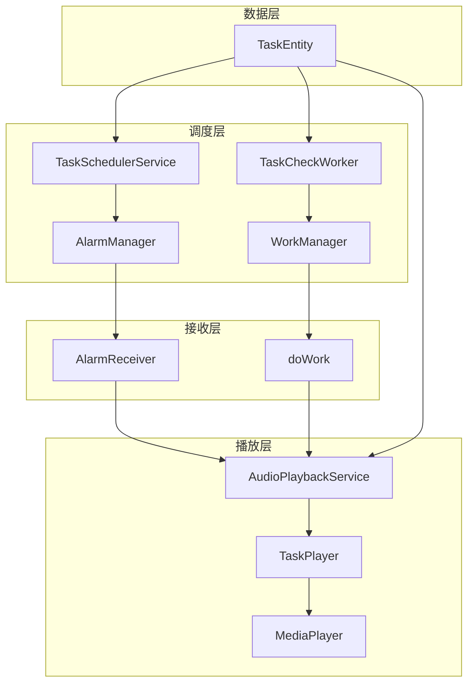

# 设计文档 - 任务调度与播放稳定性修复

## 概述
本文档描述修复跨天任务停止播放和多任务卡死两个关键 bug 的技术方案。

## 架构设计

### 系统架构图


### 问题定位

#### 问题 1：跨天任务停止播放

**根本原因**：在 `TaskSchedulerService`、`AlarmReceiver` 和 `TaskCheckWorker` 中，判断"今天是否需要执行"时，只检查当前日期是否在重复日中，没有考虑跨天任务应该检查"任务开始的那天"。

**问题代码位置**：
1. `TaskSchedulerService.java` 第 71-77 行
2. `AlarmReceiver.java` 第 91-100 行
3. `TaskCheckWorker.java` 第 63 行

**示例场景**：
- 任务设置：周一 22:00 - 02:00
- 当前时间：周二 01:00
- 错误行为：检查周二是否在重复日 → 不在 → 停止播放
- 正确行为：检查周一是否在重复日 → 在 → 继续播放

#### 问题 2：多任务卡死

**根本原因**：
1. `taskPlayers` 使用 `HashMap`（非线程安全）
2. `ExecutorService` 使用 `newCachedThreadPool()`（无上限）
3. `TaskSchedulerService` 每次创建新实例，`ExecutorService` 从未关闭
4. `playCurrentTrack()` 递归调用无深度限制

**问题代码位置**：
1. `AudioPlaybackService.java` 第 67 行：`HashMap` 非线程安全
2. `AudioPlaybackService.java` 第 149 行：`newCachedThreadPool()`
3. `AlarmReceiver.java` 第 97、110 行：每次 `new TaskSchedulerService()`
4. `AudioPlaybackService.java` 第 875、883、915 行：递归调用

## 详细设计

### 修复 1：跨天任务判断逻辑

#### 1.1 新增工具方法

在 `TaskSchedulerService` 中添加：

```java
/**
 * 判断任务是否为跨天任务
 */
private boolean isOvernightTask(TaskEntity task) {
    if (task.isAllDayPlay()) return false;
    int startMinutes = parseTimeToMinutes(task.getStartTime());
    int endMinutes = parseTimeToMinutes(task.getEndTime());
    return endMinutes <= startMinutes;
}

/**
 * 判断当前时间是否在跨天任务的有效时间范围内
 * @return 0=不在范围内, 1=在今天开始的范围内, -1=在昨天开始的范围内
 */
private int getOvernightTaskStatus(TaskEntity task, long now) {
    if (!isOvernightTask(task)) return 0;
    
    int startMinutes = parseTimeToMinutes(task.getStartTime());
    int endMinutes = parseTimeToMinutes(task.getEndTime());
    
    Calendar nowCal = Calendar.getInstance();
    nowCal.setTimeInMillis(now);
    int currentMinutes = nowCal.get(Calendar.HOUR_OF_DAY) * 60 + nowCal.get(Calendar.MINUTE);
    
    // 当前时间在 [startTime, 24:00) 范围内 → 今天开始的任务
    if (currentMinutes >= startMinutes) {
        return 1;
    }
    // 当前时间在 [00:00, endTime) 范围内 → 昨天开始的任务
    if (currentMinutes < endMinutes) {
        return -1;
    }
    return 0;
}

/**
 * 检查跨天任务是否应该执行（考虑昨天开始的情况）
 */
private boolean shouldOvernightTaskRun(TaskEntity task, int repeatDays) {
    if (repeatDays == 0) return true; // 无重复限制
    
    long now = System.currentTimeMillis();
    int status = getOvernightTaskStatus(task, now);
    
    if (status == 1) {
        // 今天开始的任务，检查今天
        int todayFlag = getDayFlag(Calendar.getInstance().get(Calendar.DAY_OF_WEEK));
        return (repeatDays & todayFlag) != 0;
    } else if (status == -1) {
        // 昨天开始的任务，检查昨天
        Calendar yesterday = Calendar.getInstance();
        yesterday.add(Calendar.DAY_OF_YEAR, -1);
        int yesterdayFlag = getDayFlag(yesterday.get(Calendar.DAY_OF_WEEK));
        return (repeatDays & yesterdayFlag) != 0;
    }
    return false;
}

private int parseTimeToMinutes(String time) {
    if (time == null || time.isEmpty()) return 0;
    String[] parts = time.split(":");
    return Integer.parseInt(parts[0]) * 60 + Integer.parseInt(parts[1]);
}
```

#### 1.2 修改调度逻辑

修改 `TaskSchedulerService.scheduleTask()` 中的判断：

```java
// 修改前
boolean shouldRunToday = true;
if (repeatDays != 0) {
    int todayFlag = getDayFlag(Calendar.getInstance().get(Calendar.DAY_OF_WEEK));
    shouldRunToday = (repeatDays & todayFlag) != 0;
}

// 修改后
boolean shouldRun = true;
if (repeatDays != 0) {
    if (isOvernightTask(task)) {
        shouldRun = shouldOvernightTaskRun(task, repeatDays);
    } else {
        int todayFlag = getDayFlag(Calendar.getInstance().get(Calendar.DAY_OF_WEEK));
        shouldRun = (repeatDays & todayFlag) != 0;
    }
}
```

#### 1.3 修改 AlarmReceiver

修改 `handleTaskStart()` 中的判断：

```java
// 修改前
if (task.getRepeatDays() != 0) {
    int todayFlag = getTodayFlag();
    if ((task.getRepeatDays() & todayFlag) == 0) {
        // 跳过
    }
}

// 修改后
if (task.getRepeatDays() != 0) {
    if (!shouldTaskRunNow(task)) {
        // 跳过
    }
}

private boolean shouldTaskRunNow(TaskEntity task) {
    int repeatDays = task.getRepeatDays();
    if (repeatDays == 0) return true;
    
    // 检查是否为跨天任务
    if (isOvernightTask(task)) {
        return shouldOvernightTaskRun(task, repeatDays);
    }
    
    int todayFlag = getTodayFlag();
    return (repeatDays & todayFlag) != 0;
}
```

#### 1.4 修改 TaskCheckWorker

修改 `shouldExecuteToday()` 方法：

```java
private boolean shouldExecuteToday(TaskEntity task, int dayOfWeek) {
    int repeatDays = task.getRepeatDays();
    if (repeatDays == 0) return true;
    
    // 跨天任务特殊处理
    if (isOvernightTask(task)) {
        return shouldOvernightTaskRun(task, repeatDays, dayOfWeek);
    }
    
    int dayFlag = getDayFlag(dayOfWeek);
    return (repeatDays & dayFlag) != 0;
}

private boolean isOvernightTask(TaskEntity task) {
    if (task.isAllDayPlay()) return false;
    int startMinutes = parseTimeToMinutes(task.getStartTime());
    int endMinutes = parseTimeToMinutes(task.getEndTime());
    return endMinutes <= startMinutes;
}

private boolean shouldOvernightTaskRun(TaskEntity task, int repeatDays, int currentDayOfWeek) {
    Calendar now = Calendar.getInstance();
    int currentMinutes = now.get(Calendar.HOUR_OF_DAY) * 60 + now.get(Calendar.MINUTE);
    int startMinutes = parseTimeToMinutes(task.getStartTime());
    int endMinutes = parseTimeToMinutes(task.getEndTime());
    
    // 当前在 [startTime, 24:00) → 检查今天
    if (currentMinutes >= startMinutes) {
        int todayFlag = getDayFlag(currentDayOfWeek);
        return (repeatDays & todayFlag) != 0;
    }
    // 当前在 [00:00, endTime) → 检查昨天
    if (currentMinutes < endMinutes) {
        Calendar yesterday = Calendar.getInstance();
        yesterday.add(Calendar.DAY_OF_YEAR, -1);
        int yesterdayFlag = getDayFlag(yesterday.get(Calendar.DAY_OF_WEEK));
        return (repeatDays & yesterdayFlag) != 0;
    }
    return false;
}
```

### 修复 2：多任务稳定性

#### 2.1 使用线程安全的集合

```java
// 修改前
private final Map<Long, TaskPlayer> taskPlayers = new HashMap<>();
private final Map<Long, Long> taskLogIds = new HashMap<>();
private final Map<Long, Integer> taskOutputDevices = new HashMap<>();

// 修改后
private final Map<Long, TaskPlayer> taskPlayers = new ConcurrentHashMap<>();
private final Map<Long, Long> taskLogIds = new ConcurrentHashMap<>();
private final Map<Long, Integer> taskOutputDevices = new ConcurrentHashMap<>();
```

#### 2.2 使用固定大小线程池

```java
// 修改前
executorService = Executors.newCachedThreadPool();

// 修改后
executorService = Executors.newFixedThreadPool(4);
```

#### 2.3 TaskSchedulerService 单例化

```java
public class TaskSchedulerService {
    private static volatile TaskSchedulerService instance;
    private static final Object lock = new Object();
    
    public static TaskSchedulerService getInstance(Context context) {
        if (instance == null) {
            synchronized (lock) {
                if (instance == null) {
                    instance = new TaskSchedulerService(context);
                }
            }
        }
        return instance;
    }
    
    private TaskSchedulerService(Context context) {
        this.context = context.getApplicationContext();
        this.alarmManager = (AlarmManager) context.getSystemService(Context.ALARM_SERVICE);
        this.executorService = Executors.newSingleThreadExecutor();
    }
}
```

#### 2.4 递归调用添加深度限制

```java
private void playCurrentTrack() {
    playCurrentTrackWithRetry(0);
}

private void playCurrentTrackWithRetry(int retryCount) {
    // 防止无限递归
    if (retryCount > playlist.size()) {
        Log.e(TAG, "All tracks failed to play, stopping task " + task.getId());
        isPlaying = false;
        // 记录错误
        recordPlaybackError(task.getId(), LogErrorType.ALL_FILES_FAILED, 
                "所有音频文件都无法播放");
        // 通知任务停止
        mainHandler.post(() -> {
            stopTask(task.getId());
        });
        return;
    }
    
    // ... 原有播放逻辑 ...
    
    // 在 catch 块中使用 retryCount
    } catch (SecurityException e) {
        currentIndex++;
        playCurrentTrackWithRetry(retryCount + 1);
    } catch (IOException e) {
        currentIndex++;
        playCurrentTrackWithRetry(retryCount + 1);
    }
}
```

#### 2.5 AlarmReceiver 使用单例

```java
// 修改前
new TaskSchedulerService(context).scheduleTask(task);

// 修改后
TaskSchedulerService.getInstance(context).scheduleTask(task);
```

## 安全考虑

- 所有集合操作使用线程安全类
- 递归调用有深度限制，防止栈溢出
- 线程池有大小限制，防止资源耗尽
- 单例模式防止重复创建资源

## 测试策略

### 跨天任务测试
| 测试用例 | 操作 | 预期结果 |
|---------|------|----------|
| 周一 22:00-02:00 任务 | 周二 01:00 检查 | 继续播放 |
| 周一 22:00-02:00 任务 | 周二 03:00 检查 | 停止播放 |
| 每天 23:00-01:00 任务 | 任意日凌晨 00:30 | 继续播放 |

### 多任务稳定性测试
| 测试用例 | 操作 | 预期结果 |
|---------|------|----------|
| 创建 20 个任务 | 同时启用 | 无卡死 |
| 5 个任务同时触发 | 等待触发 | 全部正常播放 |
| 连续运行 24 小时 | 监控内存 | 内存无明显增长 |
| 所有音频文件无效 | 触发播放 | 优雅停止，不崩溃 |

## 影响范围

| 文件 | 修改内容 |
|------|----------|
| `TaskSchedulerService.java` | 单例化 + 跨天判断逻辑 |
| `AlarmReceiver.java` | 跨天判断 + 使用单例 |
| `TaskCheckWorker.java` | 跨天判断逻辑 |
| `AudioPlaybackService.java` | 线程安全集合 + 固定线程池 + 递归限制 |

## 向后兼容性

- 不修改数据库结构
- 不修改任务实体
- 不修改用户界面
- 现有任务无需重新配置
