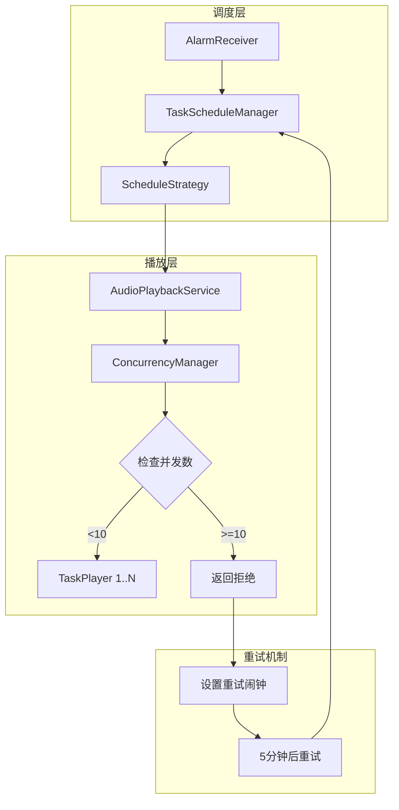

# 设计文档 - 多任务并发播放限制

## 概述

在现有多任务播放架构基础上，增加最大并发播放数限制（10个）。当达到上限时拒绝新任务启动，通过重试机制等待空位，超时则跳过本次执行。

## 架构设计

### 系统架构图



### 组件职责

| 组件 | 职责 |
|-----|------|
| `AudioPlaybackService` | 播放服务，管理 TaskPlayer 集合，提供并发数查询 |
| `ConcurrencyManager` | 新增：并发控制管理器，封装并发检查和计数逻辑 |
| `TaskScheduleManager` | 调度管理，调用播放服务前先检查并发数 |
| `AlarmScheduler` | 新增重试闘钟类型，设置5分钟后的重试闹钟 |
| `BaseScheduleStrategy` | 策略基类，增加并发限制处理逻辑 |

## 详细设计

### 1. 新增状态枚举值

**文件**: `TaskExecutionState.java`

```java
public enum TaskExecutionState {
    IDLE(0, "空闲"),
    SCHEDULED(1, "已调度"),
    EXECUTING(2, "执行中"),
    PAUSED(3, "已暂停"),
    COMPLETED(4, "已完成"),
    DISABLED(5, "已禁用"),
    SKIPPED(6, "已跳过"),           // 新增：因并发限制跳过
    WAITING_SLOT(7, "等待空位");     // 新增：等待播放空位
    
    // ... 其他代码
}
```

状态转换：
```
SCHEDULED -> WAITING_SLOT (并发达上限)
WAITING_SLOT -> EXECUTING (获得空位)
WAITING_SLOT -> SKIPPED (等待超时)
SKIPPED -> SCHEDULED (重复任务下一次调度)
SKIPPED -> DISABLED (一次性任务完成)
```

### 2. 并发控制管理器

**新文件**: `ConcurrencyManager.java`

```java
package com.caleb.scheduledplayer.service.player;

/**
 * 并发播放控制管理器
 */
public class ConcurrencyManager {
    
    public static final int MAX_CONCURRENT_PLAYBACK = 10;
    
    private final Map<Long, TaskPlayer> taskPlayers;
    
    public ConcurrencyManager(Map<Long, TaskPlayer> taskPlayers) {
        this.taskPlayers = taskPlayers;
    }
    
    /**
     * 检查是否可以启动新的播放任务
     * @return true 如果当前播放数 < 10
     */
    public synchronized boolean canStartPlayback() {
        return taskPlayers.size() < MAX_CONCURRENT_PLAYBACK;
    }
    
    /**
     * 获取当前播放任务数
     */
    public int getCurrentPlaybackCount() {
        return taskPlayers.size();
    }
    
    /**
     * 获取剩余可用播放槽位数
     */
    public int getAvailableSlots() {
        return MAX_CONCURRENT_PLAYBACK - taskPlayers.size();
    }
}
```

### 3. AudioPlaybackService 修改

**文件**: `AudioPlaybackService.java`

```java
public class AudioPlaybackService extends Service {
    
    // 新增：并发管理器
    private ConcurrencyManager concurrencyManager;
    
    // 新增：播放结果回调
    public interface PlaybackStartResult {
        void onSuccess();
        void onRejectedDueToConcurrencyLimit(int currentCount);
    }
    
    @Override
    public void onCreate() {
        // ... 现有代码
        concurrencyManager = new ConcurrencyManager(taskPlayers);
    }
    
    /**
     * 尝试启动任务播放（带并发检查）
     * @return true 如果成功启动，false 如果因并发限制被拒绝
     */
    public boolean tryStartTask(long taskId) {
        if (!concurrencyManager.canStartPlayback()) {
            Log.w(TAG, "Cannot start task " + taskId + 
                ": concurrent playback limit reached (" + 
                concurrencyManager.getCurrentPlaybackCount() + "/" + 
                ConcurrencyManager.MAX_CONCURRENT_PLAYBACK + ")");
            return false;
        }
        startTask(taskId);
        return true;
    }
    
    /**
     * 检查是否可以启动新播放
     */
    public boolean canStartNewPlayback() {
        return concurrencyManager.canStartPlayback();
    }
    
    /**
     * 获取当前播放任务数
     */
    public int getPlayingTaskCount() {
        return concurrencyManager.getCurrentPlaybackCount();
    }
    
    // 新增静态方法：带并发检查的启动
    public static boolean tryStartTaskPlayback(Context context, long taskId) {
        // 通过 Binder 或广播机制查询并发状态
        // 如果无法获取服务实例，默认允许（服务会在 startTaskPlayback 中再次检查）
        Intent intent = new Intent(context, AudioPlaybackService.class);
        intent.setAction(ACTION_TRY_START_TASK);
        intent.putExtra(EXTRA_TASK_ID, taskId);
        context.startForegroundService(intent);
        return true; // 异步处理，结果通过回调返回
    }
}
```

### 4. 重试闹钟机制

**文件**: `AlarmScheduler.java`

```java
public class AlarmScheduler {
    
    // 新增 Action
    public static final String ACTION_RETRY_START = 
        "com.caleb.scheduledplayer.RETRY_START";
    
    // 重试间隔：5分钟
    private static final long RETRY_INTERVAL_MS = 5 * 60 * 1000L;
    
    /**
     * 设置重试启动闹钟
     * @param taskId 任务ID
     */
    public void setRetryAlarm(long taskId) {
        long triggerTime = System.currentTimeMillis() + RETRY_INTERVAL_MS;
        
        Intent intent = new Intent(context, AlarmReceiver.class);
        intent.setAction(ACTION_RETRY_START);
        intent.putExtra(AlarmReceiver.EXTRA_TASK_ID, taskId);
        
        int requestCode = calculateRetryRequestCode(taskId);
        PendingIntent pendingIntent = PendingIntent.getBroadcast(
            context, requestCode, intent,
            PendingIntent.FLAG_UPDATE_CURRENT | PendingIntent.FLAG_IMMUTABLE
        );
        
        alarmManager.setExactAndAllowWhileIdle(
            AlarmManager.RTC_WAKEUP, triggerTime, pendingIntent
        );
        
        Log.d(TAG, "Set retry alarm for task " + taskId + 
            " at " + new Date(triggerTime));
    }
    
    /**
     * 取消重试闹钟
     */
    public void cancelRetryAlarm(long taskId) {
        Intent intent = new Intent(context, AlarmReceiver.class);
        intent.setAction(ACTION_RETRY_START);
        intent.putExtra(AlarmReceiver.EXTRA_TASK_ID, taskId);
        
        int requestCode = calculateRetryRequestCode(taskId);
        PendingIntent pendingIntent = PendingIntent.getBroadcast(
            context, requestCode, intent,
            PendingIntent.FLAG_NO_CREATE | PendingIntent.FLAG_IMMUTABLE
        );
        
        if (pendingIntent != null) {
            alarmManager.cancel(pendingIntent);
        }
    }
    
    /**
     * 计算重试闹钟的 RequestCode
     * 使用 taskId * 3 + 2 区分（开始=*2, 结束=*2+1, 重试=*3+2）
     */
    private int calculateRetryRequestCode(long taskId) {
        return (int) (taskId % 500000000) * 3 + 2;
    }
}
```

### 5. AlarmReceiver 处理重试

**文件**: `AlarmReceiver.java`

```java
@Override
public void onReceive(Context context, Intent intent) {
    String action = intent.getAction();
    
    if (AlarmScheduler.ACTION_RETRY_START.equals(action)) {
        long taskId = intent.getLongExtra(EXTRA_TASK_ID, -1);
        if (taskId != -1) {
            handleRetryStart(context, taskId);
        }
        return;
    }
    
    // ... 现有的 START/STOP 处理
}

private void handleRetryStart(Context context, long taskId) {
    ExecutorService executor = Executors.newSingleThreadExecutor();
    executor.execute(() -> {
        TaskEntity task = AppDatabase.getInstance(context)
            .taskDao().getTaskByIdSync(taskId);
        
        if (task == null || !task.isEnabled()) {
            return;
        }
        
        TaskScheduleManager manager = TaskScheduleManager.getInstance(context);
        manager.handleRetryStart(task);
    });
    executor.shutdown();
}
```

### 6. TaskScheduleManager 新增方法

**文件**: `TaskScheduleManager.java`

```java
/**
 * 处理重试启动
 */
public void handleRetryStart(TaskEntity task) {
    synchronized (getTaskLock(task.getId())) {
        TaskExecutionState currentState = task.getExecutionStateEnum();
        
        // 只有 WAITING_SLOT 状态才处理重试
        if (currentState != TaskExecutionState.WAITING_SLOT) {
            Log.d(TAG, "Task " + task.getId() + 
                " state is " + currentState + ", skip retry");
            return;
        }
        
        // 检查是否已超过结束时间
        long now = System.currentTimeMillis();
        if (task.getCurrentExecutionEnd() > 0 && now >= task.getCurrentExecutionEnd()) {
            Log.d(TAG, "Task " + task.getId() + 
                " execution window expired, marking as SKIPPED");
            handleSkipDueToConcurrency(task);
            return;
        }
        
        // 尝试启动
        TaskType type = TaskClassifier.classify(task);
        ScheduleStrategy strategy = strategies.get(type);
        if (strategy != null) {
            strategy.handleRetryStart(task, this);
        }
    }
}

/**
 * 处理因并发限制跳过的任务
 */
public void handleSkipDueToConcurrency(TaskEntity task) {
    // 更新状态为 SKIPPED
    updateTaskState(task, TaskExecutionState.SKIPPED);
    
    // 记录日志
    // logRepository.createSkippedLog(task.getId(), "并发限制等待超时");
    
    // 如果是重复任务，调度下一次
    if (!task.isOneTime()) {
        // 重置状态并调度下一次
        updateTaskState(task, TaskExecutionState.IDLE);
        TaskType type = TaskClassifier.classify(task);
        ScheduleStrategy strategy = strategies.get(type);
        if (strategy != null) {
            strategy.schedule(task, this);
        }
    } else {
        // 一次性任务，禁用
        disableOneTimeTask(task);
    }
}

/**
 * 检查并发并尝试启动播放
 * @return true 如果成功启动或设置了重试，false 如果无法处理
 */
public boolean tryStartPlaybackWithConcurrencyCheck(TaskEntity task, 
        long executionStart, long executionEnd) {
    
    // 从数据库检查并发数
    int currentCount = taskDao.getExecutingTaskCount();
    if (currentCount >= ConcurrencyManager.MAX_CONCURRENT_PLAYBACK) {
        Log.w(TAG, "Concurrent playback limit reached (" + currentCount + "/10), " +
            "task " + task.getId() + " waiting for slot");
        
        // 更新状态为等待空位
        updateTaskExecutionInfo(task, TaskExecutionState.WAITING_SLOT, 
            executionStart, executionEnd);
        
        // 设置重试闹钟
        alarmScheduler.setRetryAlarm(task.getId());
        
        // 记录日志
        // logRepository.createWaitingLog(task.getId(), 
        //     "因并发播放数已达上限(10)，任务等待中");
        
        return true; // 已处理（设置了重试）
    }
    
    // 可以启动：先更新状态，再启动播放
    updateTaskExecutionInfo(task, TaskExecutionState.EXECUTING, 
        executionStart, executionEnd);
    startPlayback(task);
    return true;
}
```

### 7. BaseScheduleStrategy 修改

**文件**: `BaseScheduleStrategy.java`

```java
/**
 * 启动播放并更新状态为执行中（带并发检查）
 */
protected void startPlaybackAndUpdateState(TaskEntity task, TaskScheduleManager manager, 
        long executionStart, long executionEnd) {
    logSchedule(task, "Attempting to start playback");
    
    // 使用带并发检查的启动方法
    manager.tryStartPlaybackWithConcurrencyCheck(task, executionStart, executionEnd);
}

/**
 * 处理重试启动（默认实现）
 */
public void handleRetryStart(TaskEntity task, TaskScheduleManager manager) {
    logSchedule(task, "Retry start triggered");
    
    // 检查任务是否仍应活跃
    TimeCheckResult checkResult = TaskTimeCalculator.shouldBeActiveNow(task);
    if (!checkResult.isActive()) {
        logSchedule(task, "Task should not be active now, skip retry");
        manager.handleSkipDueToConcurrency(task);
        return;
    }
    
    // 重新尝试启动
    long now = System.currentTimeMillis();
    long endTime = task.getCurrentExecutionEnd();
    
    manager.tryStartPlaybackWithConcurrencyCheck(task, now, endTime);
}
```

### 8. 数据库迁移

**新文件**: `migrations/20260116_001_add_skipped_state.go` (Room Migration)

由于 `execution_state` 是整数字段，新增枚举值不需要数据库迁移，只需确保：
- 代码中 `TaskExecutionState.fromValue()` 能处理新值
- UI 层能正确显示新状态

### 9. UI 显示 SKIPPED 状态

**文件**: `item_task.xml` / `TaskAdapter.java`

在任务列表中显示"已跳过"状态标签：

```java
// TaskAdapter.java 或 TaskViewHolder
private void bindExecutionState(TaskEntity task) {
    TaskExecutionState state = task.getExecutionStateEnum();
    
    switch (state) {
        case SKIPPED:
            stateLabel.setText("已跳过");
            stateLabel.setBackgroundColor(Color.parseColor("#FFA500")); // 橙色
            stateLabel.setVisibility(View.VISIBLE);
            break;
        case WAITING_SLOT:
            stateLabel.setText("等待中");
            stateLabel.setBackgroundColor(Color.parseColor("#FFD700")); // 金色
            stateLabel.setVisibility(View.VISIBLE);
            break;
        // ... 其他状态
    }
}
```

## 关键流程

### 启动播放流程

```
1. AlarmReceiver 收到 START 闹钟
2. 调用 Strategy.handleStart()
3. 调用 manager.tryStartPlaybackWithConcurrencyCheck()
4. 检查 AudioPlaybackService.getPlayingTaskCount()
   ├─ < 10: 正常启动，状态 -> EXECUTING
   └─ >= 10: 状态 -> WAITING_SLOT，设置5分钟重试闹钟
5. 重试时重复步骤 3-4
6. 如果重试时已超过结束时间：状态 -> SKIPPED
```

### 并发计数获取（基于数据库）

通过查询数据库中 `execution_state = EXECUTING` 的任务数量获取当前播放数：

**文件**: `TaskDao.java`

```java
/**
 * 获取当前正在执行的任务数量
 * 用于并发播放限制检查
 */
@Query("SELECT COUNT(*) FROM tasks WHERE execution_state = 2")
int getExecutingTaskCount();

/**
 * 获取当前正在执行的任务数量（LiveData 版本，用于 UI 观察）
 */
@Query("SELECT COUNT(*) FROM tasks WHERE execution_state = 2")
LiveData<Integer> getExecutingTaskCountLive();
```

**文件**: `ConcurrencyManager.java`

```java
public class ConcurrencyManager {
    
    public static final int MAX_CONCURRENT_PLAYBACK = 10;
    
    private final TaskDao taskDao;
    
    public ConcurrencyManager(TaskDao taskDao) {
        this.taskDao = taskDao;
    }
    
    /**
     * 检查是否可以启动新的播放任务
     * @return true 如果当前执行中任务数 < 10
     */
    public boolean canStartPlayback() {
        int currentCount = taskDao.getExecutingTaskCount();
        return currentCount < MAX_CONCURRENT_PLAYBACK;
    }
    
    /**
     * 获取当前执行中任务数
     */
    public int getCurrentPlaybackCount() {
        return taskDao.getExecutingTaskCount();
    }
    
    /**
     * 获取剩余可用播放槽位数
     */
    public int getAvailableSlots() {
        return MAX_CONCURRENT_PLAYBACK - getCurrentPlaybackCount();
    }
}
```

**优点：**
- 服务重启后状态不丢失
- 与任务状态机完全一致
- 不依赖内存变量或服务是否运行
- 多进程场景下数据一致

**注意事项：**
- 状态更新必须及时：启动播放前先更新状态为 `EXECUTING`，停止后立即更新状态
- 异常处理：播放异常结束时确保状态正确重置

## 安全考虑

1. **线程安全**：并发检查和启动需要原子操作，使用 `synchronized` 保护
2. **服务状态**：处理服务未启动时的并发计数查询
3. **闹钟可靠性**：重试闹钟使用 `setExactAndAllowWhileIdle` 确保 Doze 模式下也能触发

## 测试策略

### 单元测试
- `ConcurrencyManager.canStartPlayback()` 边界测试（0, 9, 10, 11）
- `TaskExecutionState` 新状态的转换规则测试

### 集成测试
- 同时启动 11 个任务，验证第 11 个被拒绝
- 停止一个任务后，等待中的任务能成功启动
- 重试超时后任务正确标记为 SKIPPED

### 场景测试
- 设备重启后，WAITING_SLOT 状态任务的恢复
- 任务结束时间到达但仍在等待的处理

