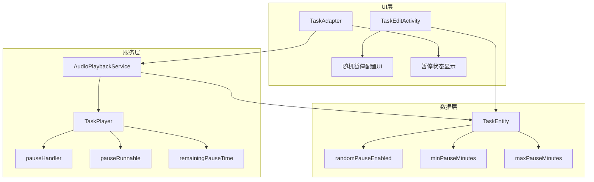

# 设计文档 - 随机暂停功能

## 概述
在 `AudioPlaybackService` 的 `TaskPlayer` 中实现歌曲播放完成后的随机暂停功能。通过 `Handler.postDelayed()` 实现定时器，在暂停结束后自动播放下一首歌曲。UI 层通过扩展 `PlaybackState` 来显示暂停状态和剩余时间。

## 架构设计

### 系统架构图


### 技术栈
- **数据库**: Room (新增3个字段)
- **定时器**: Handler + Runnable
- **状态管理**: 扩展 PlaybackState 类

## 详细设计

### 数据模型变更

#### TaskEntity 新增字段
```java
/**
 * 是否启用随机暂停
 */
@ColumnInfo(name = "random_pause_enabled", defaultValue = "0")
private boolean randomPauseEnabled;

/**
 * 最小暂停时间（分钟）
 */
@ColumnInfo(name = "min_pause_minutes", defaultValue = "2")
private int minPauseMinutes;

/**
 * 最大暂停时间（分钟）
 */
@ColumnInfo(name = "max_pause_minutes", defaultValue = "6")
private int maxPauseMinutes;
```

#### 数据库迁移
```java
// Migration from version X to X+1
static final Migration MIGRATION_X_X1 = new Migration(X, X+1) {
    @Override
    public void migrate(SupportSQLiteDatabase database) {
        database.execSQL("ALTER TABLE tasks ADD COLUMN random_pause_enabled INTEGER NOT NULL DEFAULT 0");
        database.execSQL("ALTER TABLE tasks ADD COLUMN min_pause_minutes INTEGER NOT NULL DEFAULT 2");
        database.execSQL("ALTER TABLE tasks ADD COLUMN max_pause_minutes INTEGER NOT NULL DEFAULT 6");
    }
};
```

### PlaybackState 扩展

```java
public static class PlaybackState {
    public final boolean isPlaying;
    public final boolean isPaused;
    public final boolean isRandomPausing;      // 新增：是否处于随机暂停中
    public final long remainingPauseMillis;    // 新增：剩余暂停时间（毫秒）
    public final String currentSongName;
    public final String taskName;
    public final long taskId;
    public final int currentPosition;
    public final int duration;
    
    // 构造函数更新...
}
```

### TaskPlayer 暂停逻辑

```java
private class TaskPlayer {
    // 新增字段
    private Handler pauseHandler = new Handler(Looper.getMainLooper());
    private Runnable pauseRunnable;
    private boolean isRandomPausing = false;
    private long pauseEndTime = 0;  // 暂停结束的时间戳
    
    /**
     * 歌曲播放完成回调
     */
    @Override
    public void onCompletion(MediaPlayer mp) {
        if (task.isRandomPauseEnabled()) {
            startRandomPause();
        } else {
            currentIndex++;
            playCurrentTrack();
        }
    }
    
    /**
     * 开始随机暂停
     */
    private void startRandomPause() {
        int minMs = task.getMinPauseMinutes() * 60 * 1000;
        int maxMs = task.getMaxPauseMinutes() * 60 * 1000;
        int pauseDuration = minMs + new Random().nextInt(maxMs - minMs + 1);
        
        isRandomPausing = true;
        pauseEndTime = System.currentTimeMillis() + pauseDuration;
        
        // 通知UI更新
        notifyPlaybackStateChanged();
        
        // 设置定时器
        pauseRunnable = () -> {
            isRandomPausing = false;
            pauseEndTime = 0;
            currentIndex++;
            playCurrentTrack();
        };
        pauseHandler.postDelayed(pauseRunnable, pauseDuration);
    }
    
    /**
     * 跳过暂停，立即播放下一首
     */
    void skipPause() {
        if (isRandomPausing) {
            pauseHandler.removeCallbacks(pauseRunnable);
            isRandomPausing = false;
            pauseEndTime = 0;
            currentIndex++;
            playCurrentTrack();
        }
    }
    
    /**
     * 获取剩余暂停时间
     */
    long getRemainingPauseMillis() {
        if (!isRandomPausing || pauseEndTime == 0) return 0;
        return Math.max(0, pauseEndTime - System.currentTimeMillis());
    }
    
    /**
     * 停止时清理定时器
     */
    void stop() {
        pauseHandler.removeCallbacks(pauseRunnable);
        isRandomPausing = false;
        // ... 原有停止逻辑
    }
}
```

### UI 设计

#### TaskEditActivity 配置界面
在播放模式下方添加随机暂停配置区域：

```xml
<!-- 随机暂停配置 -->
<com.google.android.material.card.MaterialCardView
    android:id="@+id/cardRandomPause"
    style="@style/Widget.Material3.CardView.Filled">
    
    <LinearLayout
        android:orientation="vertical"
        android:padding="16dp">
        
        <!-- 开关 -->
        <LinearLayout android:orientation="horizontal">
            <TextView android:text="歌曲间随机暂停" />
            <com.google.android.material.switchmaterial.SwitchMaterial
                android:id="@+id/switchRandomPause" />
        </LinearLayout>
        
        <!-- 时间范围配置（开关打开时显示） -->
        <LinearLayout
            android:id="@+id/layoutPauseRange"
            android:visibility="gone">
            
            <TextView android:text="暂停时间范围" />
            
            <LinearLayout android:orientation="horizontal">
                <!-- 最小时间 -->
                <com.google.android.material.textfield.TextInputLayout>
                    <com.google.android.material.textfield.TextInputEditText
                        android:id="@+id/editMinPause"
                        android:inputType="number"
                        android:hint="最小(分钟)" />
                </com.google.android.material.textfield.TextInputLayout>
                
                <TextView android:text=" - " />
                
                <!-- 最大时间 -->
                <com.google.android.material.textfield.TextInputLayout>
                    <com.google.android.material.textfield.TextInputEditText
                        android:id="@+id/editMaxPause"
                        android:inputType="number"
                        android:hint="最大(分钟)" />
                </com.google.android.material.textfield.TextInputLayout>
            </LinearLayout>
        </LinearLayout>
    </LinearLayout>
</com.google.android.material.card.MaterialCardView>
```

#### TaskAdapter 暂停状态显示
在任务卡片中显示暂停状态：

```java
void updatePlaybackState(TaskEntity task) {
    boolean isThisTask = currentPlaybackState != null 
            && currentPlaybackState.taskId == task.getId();
    
    if (isThisTask && currentPlaybackState.isRandomPausing) {
        // 显示暂停状态
        progressBar.setVisibility(View.GONE);
        textSongInfo.setText("暂停中");
        
        // 显示剩余时间
        long remainingMs = currentPlaybackState.remainingPauseMillis;
        int minutes = (int) (remainingMs / 60000);
        int seconds = (int) ((remainingMs % 60000) / 1000);
        textProgress.setText(String.format("还剩 %d:%02d", minutes, seconds));
        textProgress.setVisibility(View.VISIBLE);
        
        // 播放按钮变为"跳过"功能
        buttonPlayPause.setImageResource(R.drawable.ic_skip_next);
    } else if (isThisTask && currentPlaybackState.isPlaying) {
        // 正常播放状态显示
        // ... 原有逻辑
    }
}
```

### 关键流程

#### 歌曲播放完成流程
```
1. MediaPlayer.onCompletion() 触发
2. 检查 task.isRandomPauseEnabled()
   ├─ false: 直接 currentIndex++, playCurrentTrack()
   └─ true: 
       a. 计算随机暂停时长 (minMs ~ maxMs)
       b. 设置 isRandomPausing = true
       c. 记录 pauseEndTime
       d. 通知 UI 更新状态
       e. Handler.postDelayed(pauseRunnable, duration)
3. 暂停期间:
   - UI 每秒更新剩余时间
   - 用户可点击播放按钮跳过
4. 暂停结束:
   - pauseRunnable 执行
   - isRandomPausing = false
   - currentIndex++
   - playCurrentTrack()
```

#### 用户跳过暂停流程
```
1. 用户点击播放按钮
2. MainActivity 调用 playbackService.skipRandomPause()
3. TaskPlayer.skipPause():
   a. pauseHandler.removeCallbacks(pauseRunnable)
   b. isRandomPausing = false
   c. currentIndex++
   d. playCurrentTrack()
```

## 安全考虑
- 时间范围验证：最小值不能大于最大值，范围限制在1-30分钟
- 定时器清理：在 stop() 和 onDestroy() 中确保移除所有 pending callbacks
- 状态一致性：暂停状态变更时同步更新 UI

## 测试策略

### 单元测试
- 随机暂停时长计算（边界值测试）
- 时间范围验证逻辑
- 状态转换正确性

### 集成测试
- 歌曲播放完成后正确进入暂停
- 暂停结束后正确播放下一首
- 跳过暂停功能正常
- 任务停止时定时器正确清理

### UI 测试
- 配置界面开关和输入验证
- 暂停状态和剩余时间显示
- 跳过按钮功能

## 设计决策

### 为什么使用 Handler 而不是 AlarmManager？
- 暂停时间较短（最长30分钟），Handler 足够精确
- Handler 实现简单，不需要额外的 BroadcastReceiver
- 前台服务已经持有 WakeLock，不会被系统杀死

### 为什么在 TaskPlayer 内部管理暂停状态？
- 暂停是播放流程的一部分，与 TaskPlayer 紧密相关
- 便于管理状态和清理资源
- 避免在 Service 层增加复杂的状态管理

### 为什么剩余时间使用时间戳计算而不是倒计时？
- 时间戳计算更准确，不受 UI 更新频率影响
- 即使 UI 更新有延迟，显示的剩余时间仍然准确
- 便于在任何时刻获取准确的剩余时间
